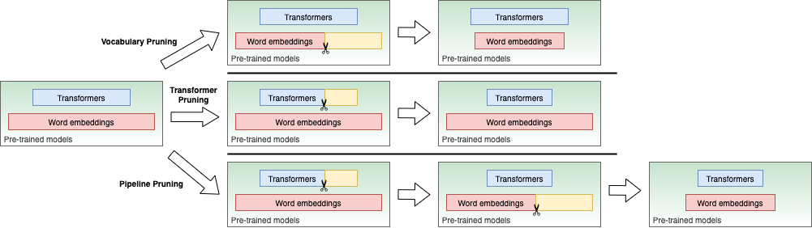

 [**English**](README.md) | [**中文说明**](README_ZH.md)

<p align="center">
    <br>
    
    <br>
<p>
<p>
<p align="center">
    <a href="https://github.com/airaria/TextPruner/blob/master/LICENSE">
        
    </a>
    <a href="https://TextPruner.readthedocs.io/">
        
    </a>    
    <a href="https://pypi.org/project/TextPruner">
        
    </a>    
    <a href="https://github.com/airaria/TextPruner/releases">
        
    </a>
</p>

**TextPruner** is a model pruning toolkit for pre-trained language models.
It provides **low-cost** and **training-free** methods to reduce your model size and speed up your model inference speed by removing redundant neurons.

You may also be interested in,

- Knowledge Distillation Toolkit - TextBrewer: https://github.com/airaria/TextBrewer
- Chinese MacBERT: https://github.com/ymcui/MacBERT
- Chinese ELECTRA: https://github.com/ymcui/Chinese-ELECTRA
- Chinese XLNet: https://github.com/ymcui/Chinese-XLNet
- CINO: https://github.com/ymcui/Chinese-Minority-PLM

## News

* [Mar 21, 2022] （new functionality in v1.1) Added vocabulary pruning for XLM, BART, T5 and mT5 models.

* [Mar 4, 2022] We are delighted to announce that TextPruner paper [*TextPruner: A Model Pruning Toolkit for Pre-Trained Language Models*](https://aclanthology.org/2022.acl-demo.4/) has been accepted to [ACL 2022 demo](https://2022.aclweb.org).

* [Jan 26, 2022] （new functionality in v1.0.1) Added support for self-supervised pruning via `use_logits` option in `TransformerPruningConfig`.

## Table of Contents

<!-- TOC -->

| Section | Contents |
|-|-|
| [Introduction](#introduction) | Introduction to TextPruner |
| [Installation](#installation) | Requirements and how to install |
| [Pruning Modes](#pruning-modes) | A brief introduction to the three pruning modes |
| [Usage](#usage) | A quick guide on how to use TextPruner |
| [Experiments](#experiments) | Pruning experiments on typical tasks |
| [FAQ](#faq) | Frequently asked questions |
| [Follow Us](#follow-us) | - |


## Introduction

**TextPruner** is a toolkit for pruning pre-trained transformer-based language models written in PyTorch. It offers structured training-free pruning methods and a user-friendly interface.

The main features of TexPruner include:

* **Compatibility**: TextPruner is compatible with different NLU pre-trained models. You can use it to prune your own models for various NLP tasks as long as they are built on the standard pre-trained models.
* **Usability**: TextPruner can be used as a package or a CLI tool. They are both easy to use.
* **Efficiency**: TextPruner reduces the model size in a simple and fast way. TextPruner uses structured training-free methods to prune models. It is much faster than distillation and other pruning methods that involve training. 

TextPruner currently supports vocabulary pruning and transformer pruning. For the explanation of the pruning modes, see [Pruning Modes](#pruning-modes).

To use TextPruner, users can either import TextPruner into the python scripts or run the TextPruner command line tool. See the examples in [Usage](#usage).

For the performance of the pruned model on typical tasks, see [Experiments](#experiments).

Paper: [*TextPruner: A Model Pruning Toolkit for Pre-Trained Language Models*](https://aclanthology.org/2022.acl-demo.4/)


### Supporting Models

TextPruner currently supports the following pre-trained models in [transformers](https://github.com/huggingface/transformers):

| Model | Vocabualry Pruning | Transformer Pruning |
|-|:-:|:-:|
| BERT | :heavy_check_mark: | :heavy_check_mark: |  
| ALBERT | :heavy_check_mark: | :heavy_check_mark: |  
| RoBERTa | :heavy_check_mark: | :heavy_check_mark: |  
| ELECTRA| :heavy_check_mark: | :heavy_check_mark: |  
| XLM-RoBERTa | :heavy_check_mark: | :heavy_check_mark: |
|XLM |  :heavy_check_mark: | :x: |
|BART |  :heavy_check_mark: | :x: |
|T5 |  :heavy_check_mark: | :x: |
|mT5 |  :heavy_check_mark: | :x: |


See the [online documentation](https://textpruner.readthedocs.io) for the API reference.


## Installation

* Requirements

    * Python >= 3.7
    * torch >= 1.7
    * transformers >= 4.0
    * sentencepiece
    * protobuf

* Install with pip

    ```bash
    pip install textpruner
    ```

*  Install from the source

    ```bash
    git clone https://github.com/airaria/TextPruner.git
    pip install ./textpruner
    ```

### Pruning Modes

In TextPruner, there are three pruning modes: **vocabulary pruning**, **transformer pruning** and **pipeline pruning**.




#### Vocabulary Pruning

The pre-trained models usually have a large vocabulary, but some tokens rarely appear in the datasets of the downstream tasks. These tokens can be removed to reduce the model size and accelerate MLM pre-training.

#### Transformer Pruning
AP

Another approach is pruning the transformer blocks. Some studies have shown that not all attention heads are equally important in the transformers. TextPruner reduces the model size and keeps the model performance as high as possible by locating and removing the unimportant attention heads and the feed-forward networks' neurons.

#### Pipeline Pruning


In pipeline pruning, TextPruner performs transformer pruning and vocabulary pruning successively to fully reduce the model size.


## Usage

The **pruners** perform the pruning process. The **configurations** set their behaviors. There names are self-explained: 
* Pruners
  * `textpruner.VocabularyPruner`
  * `textpruner.TransformerPruner`
  * `textpruner.PipelinePruner`
* Configurations
  * `textpruner.GeneralConfig`
  * `textpruner.VocabularyPruningConfig`
  * `textpruner.TransformerPruningConfig`

See the [online documentation](https://textpruner.readthedocs.io) for the API reference.
The `Configurations` are explained in [Configurations](#configurations).
We demonstrate the basic usage below.

### Vocabulary Pruning

To perform vocabulary pruning, users should provide a text file or a list of strings. The tokens that do not appear in the texts are removed from the model and the tokenizer.

See the examples at [examples/vocabulary_pruning](examples/vocabulary_pruning) and [examples/vocabulary_pruning_xnli](examples/vocabulary_pruning_xnli).

#### Use TextPruner as a package

Pruning the vocabulary in 3 lines of code:

```python
from textpruner import VocabularyPruner
pruner = VocabularyPruner(model, tokenizer)
pruner.prune(dataiter=texts)
```

*  `model` is the pre-trained model for the MLM task or other NLP tasks.
* `tokenizer` is the corresponding tokenizer.
* `texts` is a list of strings. The tokens that do not appear in the texts are removed from the model and the tokenizer.


`VocabularyPruner` accepts `GeneralConfig` and `VocabularyPruningConfig` for fine control. By default we could omit them. See the API reference for details.


#### Use TextPruner-CLI tool

```bash
textpruner-cli  \
  --pruning_mode vocabulary \
  --configurations gc.json vc.json \
  --model_class XLMRobertaForSequenceClassification \
  --tokenizer_class XLMRobertaTokenizer \
  --model_path /path/to/model/and/config/directory \
  --vocabulary /path/to/a/text/file
```
* `configurations` : configuration files in the JSON format. See [Configurations](#configurations) for details.
* `model_class` : The classname of the model. It must be accessible from the current directory. For example, if `model_class` is `modeling.ModelClassName`, there should be a `modeling.py` in the current directory. If there is no module name in `model_class`, TextPruner will try to import the `model_class` from the transformers library, as shown above.
* `tokenizer_class` : The classname of the tokenizer. It must be accessible from the current directory. If there is no module name in `tokenizer_class`, TextPruner will try to import the `tokenizer_class` from the transformers library.
* `model_path` : The directory that contains weight and the configurations for the model and the tokenizer.
* `vocabulary` : A text file that is used for generating new vocabulary. The tokens that do not appear in the vocabulary are removed from the model and the tokenizer.


### Transformer Pruning

* To perform transformer pruning on a dataset, a `dataloader` of the dataset should be provided. The `dataloader` should return both the inputs and the labels. 
* TextPruner needs the loss returned by the model to calculate neuron importance scores. TextPruner will try to guess which element in the model output is the loss. If none of the following is true:
  * the model returns  a single element, which is the loss;
  * the model output is a list or a tuple. Loss is its first element;
  * the loss of can be accessed by `output['loss'] ` or `output.loss` where `output` is the model output

  users should provide an `adaptor` function (which takes the output of the model and return the loss) to the `TransformerPruner`.

  * If running in *self-supervised* mode, TextPruner needs the logits returned by the model to calculate importance scores. In this case,  the `adaptor` should return the logits. Check the `use_logits` option in `TransformerPruningConfig` for details.

See the examples at [examples/transformer_pruning](examples/transformer_pruning).

For self-supervised pruning, see the examples [examples/transformer_pruning_xnli](examples/transformer_pruning_xnli).

#### Use TextPruner as a package

```python
from textpruner import TransformerPruner, TransformerPruningConfig
transformer_pruning_config = TransformerPruningConfig(
      target_ffn_size=2048, 
      target_num_of_heads=8, 
      pruning_method='iterative',
      n_iters=4)
pruner = TransformerPruner(model,transformer_pruning_config=transformer_pruning_config)   
pruner.prune(dataloader=dataloader, save_model=True)
```

*  `transformer_pruning_config` set the mean target size per layer (`target_ffn_size` and `target_num_of_heads`) and the number of iterations (`n_iters`) of pruning.
* `dataloader` is a PyTorch dataloader that provides inputs and labels of the dataset.

`TransformerPruner` accepts `GeneralConfig` and `TransformerPruningConfig` for fine control. See the API reference for details.


#### Use TextPruner-CLI tool

```bash
textpruner-cli  \
  --pruning_mode transformer \
  --configurations gc.json tc.json \
  --model_class XLMRobertaForSequenceClassification \
  --tokenizer_class XLMRobertaTokenizer \
  --model_path ../models/xlmr_pawsx \
  --dataloader_and_adaptor dataloader_script
```
* `configurations` : configuration files in the JSON format. See [Configurations](#configurations) for details.
* `model_class` : The classname of the model. It must be accessible from the current directory. For example, if `model_class` is `modeling.ModelClassName`, there should be a `modeling.py` in the current directory. If there is no module name in `model_class`, TextPruner will try to import the `model_class` from the transformers library, as shown above.
* `tokenizer_class` : The classname of the tokenizer. It must be accessible from the current directory. If there is no module name in `tokenizer_class`, TextPruner will try to import the `tokenizer_class` from the transformers library.
* `model_path` : The directory contains weight and the configurations for the model and the tokenizer.
* `dataloader_and_adaptor` : The python script that contains the dataloader and the adaptor (the adaptor is optional).


### Pipeline Pruning

Pipeline pruning combines transformer pruning and vocabulary pruning into a single call.

See the examples at [examples/pipeline_pruning](examples/pipeline_pruning).

#### Use TextPruner as a package

```python
from textpruner import PipelinePruner, TransformerPruningConfig
transformer_pruning_config = TransformerPruningConfig(
    target_ffn_size=2048, target_num_of_heads=8, 
    pruning_method='iterative',n_iters=4)
pruner = PipelinePruner(model, tokenizer, transformer_pruning_config=transformer_pruning_config)
pruner.prune(dataloader=dataloader, dataiter=texts, save_model=True)
```

`PipelinePruner` accepts `GeneralConfig`, `VocabularyPruningConfig` and `TransformerPruningConfig` for fine control. See the API reference for details.

#### Use TextPruner-CLI tool

```bash
textpruner-cli  \
  --pruning_mode pipeline \
  --configurations gc.json tc.json vc.json \
  --model_class XLMRobertaForSequenceClassification \
  --tokenizer_class XLMRobertaTokenizer \
  --model_path ../models/xlmr_pawsx \
  --vocabulary /path/to/a/text/file \
  --dataloader_and_adaptor dataloader_script
```

### Configurations

The pruning process is configured by the configuration objects:

* `GeneralConfig` : sets the device and the output directory.
* `VocabularyPruningConfig` : sets the token pruning threshold and whether pruning the `lm_head`.
* `TransformerPruningConfig` : sets various options on how to perform the transformer pruning process.

They are used in different pruning modes:

* Vocabulary pruning accepts `GeneralConfig` and `VocabularyPruningConfig`

  ```python
  VocabularyPruner(vocabulary_pruning_config= ..., general_config = ...)
  ```

* Transformer pruning accepts `GeneralConfig` and `TransformerPruningConfig`
  ```python
  TransformerPruner(transformer_pruning_config= ..., general_config = ...)
  ```

* Pipeline pruning accepts all the configurations
  ```python
  TransformerPruner(transformer_pruning_config= ..., vocabulary_pruning_config= ..., general_config = ...)
  ```

The configurations are dataclass objects (used in the python scripts) or JSON files (used in the command line).
If no configurations are provided, TextPruner will use the default configurations.
See the API reference for details.


In the python script:

```python
from textpruner import GeneralConfig, VocabularyPruningConfig, TransformerPruningConfig
from textpruner import VocabularyPruner, TransformerPruner, PipelinePruner

#GeneralConfig
general_config = GeneralConfig(device='auto',output_dir='./pruned_models')

#VocabularyPruningConfig
vocabulary_pruning_config = VocabularyPruningConfig(min_count=1,prune_lm_head='auto')

#TransformerPruningConfig
#Pruning with the given masks 
transformer_pruning_config = TransformerPruningConfig(pruning_method = 'masks')

#TransformerPruningConfig
#Pruning on labeled dataset iteratively
transformer_pruning_config = TransformerPruningConfig(
    target_ffn_size  = 2048,
    target_num_of_heads = 8,
    pruning_method = 'iterative',
    ffn_even_masking = True,
    head_even_masking = True,
    n_iters = 1,
    multiple_of = 1
)
```

As JSON files:

* `GeneralConfig` : [gc.json](examples/configurations/gc.json)
* `VocabularyPruningConfig` : [vc.json](examples/configurations/vc.json)
* `TransformerPruningConfig` :
    * Pruning with the given masks : [tc-masks.json](examples/configurations/tc-masks.json)
    * Pruning on labeled dataset iteratively : [tc-iterative.json](examples/configurations/tc-iterative.json)


### Helper functions

* `textpruner.summary` : show the summary of model parameters.
* `textpruner.inference_time` : measure and print the inference time of the model.

Example:

```python
from transformers import BertForMaskedLM
import textpruner
import torch

model = BertForMaskedLM.from_pretrained('bert-base-uncased')
print("Model summary:")
print(textpruner.summary(model,max_level=3))

dummy_inputs = [torch.randint(low=0,high=10000,size=(32,512))]
print("Inference time:")
textpruner.inference_time(model.to('cuda'),dummy_inputs)
```

Outputs:

```
Model summary:
LAYER NAME                          	        #PARAMS	     RATIO	 MEM(MB)
--model:                            	    109,514,810	   100.00%	  417.77
  --bert:                           	    108,892,160	    99.43%	  415.39
    --embeddings:                   	     23,837,696	    21.77%	   90.94
      --position_ids:               	            512	     0.00%	    0.00
      --word_embeddings:            	     23,440,896	    21.40%	   89.42
      --position_embeddings:        	        393,216	     0.36%	    1.50
      --token_type_embeddings:      	          1,536	     0.00%	    0.01
      --LayerNorm:                  	          1,536	     0.00%	    0.01
    --encoder
      --layer:                      	     85,054,464	    77.66%	  324.46
  --cls
    --predictions(partially shared):	        622,650	     0.57%	    2.38
      --bias:                       	         30,522	     0.03%	    0.12
      --transform:                  	        592,128	     0.54%	    2.26
      --decoder(shared):            	              0	     0.00%	    0.00

Inference time:
Device: cuda:0
Mean inference time: 1214.41ms
Standard deviation: 2.39ms
```


## Experiments


We prune a [XLM-RoBERTa-base](https://github.com/facebookresearch/XLM) classification model trained on the Multilingual Natural Language Inference (NLI) task [PAWS-X](https://github.com/google-research-datasets/paws/tree/master/pawsx). The model is fine-tuned and evaluated on the Egnlish dataset.

### Vocabulary Pruning
We use a [100k-lines subset](examples/datasets/xnli/en.tsv) of [XNLI](https://github.com/facebookresearch/XNLI) English training set as the vocabulary file. The pruning result is listed below.

| Model                | Total size (MB) | Vocab size | Acc on en (%)|
| :-------------------- | :---------------: | :----------: | :------------: |
| XLM-RoBERTa-base     | 1060 (100%)     | 250002     | 94.65        |
| + Vocabulary Pruning | 398 (37.5%)     | 23936      | 94.20        |

### Transfomer Pruning

We denote the model structure as `(H, F)` where `H` is the average number of attention heads per layer, `F` is the average FFN hidden size per layer. With this notation, `(12,3072)` stands for the original XLM-RoBERTa model. In addition we consider (8, 2048) and (6, 1536).

#### Inference time 

The speed is measured on inputs of length 512 and batch size 32. 
Each layer of the model has the same number of attention heads and FFN hidden size.

| Model      | Total size (MB) | Encoder size (MB) | Inference time (ms) | Speed up |
| :---------- | :---------------: | :-----------------: | :-------------------: | :--------: |
| (12, 3072) | 1060            | 324               | 1012                | 1.0x     |
| (8, 2048)  | 952             | 216               | 666                 | 1.5x     |
| (6, 1536)  | 899             | 162               | 504                 | 2.0x     |


#### Performance

We prune the model with different numbers of iterations (`n_iters`). The accuracies are listed below:

| Model      | n_iters=1           |           n_iters=2 |           n_iters=4 |           n_iters=8 |           n_iters=16 |
| :------------ | :-----------: | :-----------: | :-----------: | :-----------: | :------------: |
| (12, 3072)   | 94.65       | -           | -           | -           | -            |
| (8, 2048)    | 93.30       | 93.60       | 93.60       | 93.85       | 93.95        |
| (8, 2048) with uneven heads   | 92.95       | 93.50       | 93.95       | 94.05        | **94.25**    |
| (6, 1536)    | 85.15       | 89.10       | 90.90       | 90.60       | 90.85        |
| (6, 1536) with uneven heads   | 45.35       | 86.45       |  90.55     | 90.90         | **91.95**    |

`uneven heads` means the number of attention heads may vary from layer to layer.
With the same model structure, the performance increases as we increase the number of iterations `n_iters`. 

## FAQ

**Q: Does TextPruner support Tensorflow 2 ?**

A: No. 

**Q: Can you compare the knowledge distillation and model pruning? Which one should I use ?**

A: Both model pruning and knowledge distillation are popular approaches for reducing the model size and accelerating model speed. 

* Knowledge distillation usually achieves better performance and a higher compression ratio, but the distillation process is computationally expensive and time-costing. It requires accessing a large amount of data for training.

* The structured training-free pruning usually leads to a lower performance than knowledge distillation, but the method is fast and light. The pruning process can be finished within minutes, and only requires a small amount of data for guiding the pruning process.

(There are some pruning methods that involves training can also achieve a high compression ratio)

If you are interested in applying knowledge distillation, please refer to our [TextBrewer](http://textbrewer.hfl-rc.com).

if you want to achieve the best performance, you may consider applying both distillation and pruning.

## Citation
If you find TextPruner is helpful, please cite our [paper](https://aclanthology.org/2022.acl-demo.4):
```
@inproceedings{yang-etal-2022-textpruner,
    title = "{T}ext{P}runer: A Model Pruning Toolkit for Pre-Trained Language Models",
    author = "Yang, Ziqing  and
      Cui, Yiming  and
      Chen, Zhigang",
    booktitle = "Proceedings of the 60th Annual Meeting of the Association for Computational Linguistics: System Demonstrations",
    month = may,
    year = "2022",
    address = "Dublin, Ireland",
    publisher = "Association for Computational Linguistics",
    url = "https://aclanthology.org/2022.acl-demo.4",
    pages = "35--43"
}
```

## Follow Us
Follow our official WeChat account to keep updated with our latest technologies!


